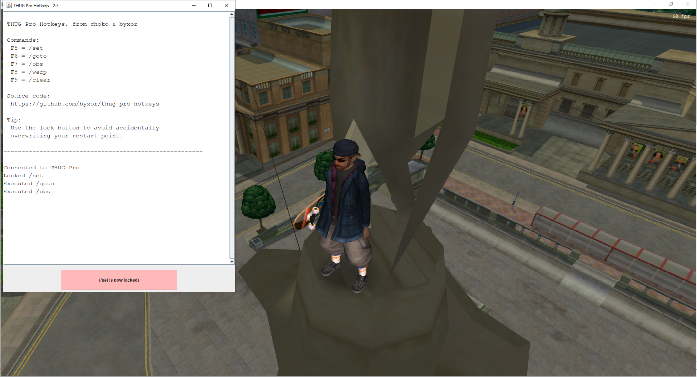

# thug-pro-hotkeys

Hotkeys for typed commands in THUG Pro.

Big thanks to choko for writing the original C# application



## Download

You can download all versions from the [releases](https://www.github.com/byxor/thug-pro-hotkeys/releases) page.

## Usage

1. Launch THUG Pro
2. Launch thug-pro-hotkeys

```
F5 - Set Restart Point.
F6 - Goto Restart Point.
F7 - Observe Players.
F8 - Warp to Player.
F9 - Clear the chat.
```

## Running the program (as a dev)

```
gradlew run
```

## Running the tests (as a dev)

```
gradlew build
```

## Building an executable JAR (as a dev)

```
gradlew build
```

The executable JAR file will be located in the `build/libs` directory: `thug-pro-hotkeys.jar`.